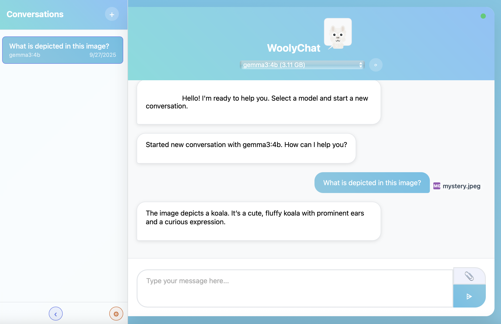

# WoolyChat - Ollama Chat Interface with File Attachments

A contemporary web interface for interacting with Ollama models, built with Flask and vanilla JavaScript. Supports multimodal conversations with file attachments, theme customization, and persistent conversation history.

I am planning to add things like Projects, Project Knowledge, folders, and unstructured tagging, but who knows when that'll happen. I only went down this rabbit hole because Open WebUI stopped letting me login locally and I didn't get why I needed an account with them in the first place.



## Releases

MacOS .app available. Windows .exe coming soon.
[Releases](https://github.com/haasr/woolychat_releases)

## 🌟 Key Features

### Core Functionality
- **Real-time Streaming Chat** - Live responses from Ollama models with typing indicators
- **Multimodal Support** - Send images, documents, and text files to vision-capable models
- **File Upload System** - Drag & drop or click to upload with 5MB limit
- **Conversation Management** - Persistent chat history with SQLite database
- **Multiple Model Support** - Switch between any locally available Ollama models

### File Attachment Capabilities
- **Supported Formats**: 
  - Images: JPG, PNG, GIF, BMP, WebP
  - Documents: PDF, DOC, DOCX, TXT, MD, RTF
  - Data: CSV, XLS, XLSX, JSON, XML, HTML
- **Smart Processing**: 
  - Images sent as base64 to vision models
  - Text extraction from documents
  - Content preview and metadata display
- **Visual Feedback**: Real-time upload progress and status

### User Experience
- **9 Beautiful Themes** - Ocean Breeze, Golden, Autumn, Midnight, Cyberpunk, Vinyl, Forest, Moonlit Lilac, Zebra, Koala
- **Responsive Design** - Mobile-friendly interface with adaptive layouts
- **Settings Panel** - Theme selection, markdown toggle, auto-scroll options
- **Drag & Drop Interface** - Intuitive file attachment workflow

## 🏗️ Architecture

### Backend (Python/Flask)
```
woolychat/
├── ollama_chat.py          # Main Flask application
├── models.py               # SQLAlchemy database models
├── utils/                  # Modular utility classes
│   ├── __init__.py
│   ├── file_manager.py     # File upload/validation/storage
│   ├── text_extractor.py   # Content extraction from files
│   └── conversation_manager.py # Database operations
└── uploads/                # File storage directory
```

### Frontend (Vanilla JavaScript)
```
static/
├── chat.js                 # Main application logic
├── style.css               # Comprehensive styling
└── img/
    └── woolychat.png       # Application logo
```

### Database Schema
```sql
-- Users table
User: id, username, email, created_at

-- Conversations table  
Conversation: id, user_id, title, model_name, created_at, updated_at, 
              message_count, is_archived, is_favorite

-- Messages table
Message: id, conversation_id, role, content, created_at, message_metadata

-- File attachments table
MessageAttachment: id, message_id, filename, original_filename, 
                   file_path, file_size, mime_type, uploaded_at,
                   extracted_text, is_processed, processing_error

-- Tags and Projects (for future organization features)
Tag: id, name, color, created_at
Project: id, user_id, name, description, color, created_at
```

## 🔧 Technical Implementation

### File Upload Flow
1. **Client-side validation** - File type, size, and format checking
2. **Multipart upload** - FormData sent to `/api/upload` endpoint
3. **Server processing** - File storage, text extraction, metadata creation
4. **Database persistence** - Attachment linked to message when sent
5. **Ollama integration** - Images as base64, text content in message

### Message Processing Pipeline
```python
# 1. File Analysis
if mime_type.startswith('image/'):
    # Convert to base64 for vision models
    images_base64.append(base64_data)
else:
    # Extract text content for context
    text_content += extract_text_from_file(file_path, mime_type)

# 2. Ollama API Request
ollama_request = {
    'model': model_name,
    'messages': conversation_history + [{
        'role': 'user',
        'content': text_content,
        'images': images_base64  # Only for image attachments
    }],
    'stream': True
}
```

### Theme System
- **CSS Custom Properties** - Dynamic theme switching via root variables
- **Context Processor** - Server-side theme injection into templates
- **Session Storage** - Persistent theme preferences
- **Live Preview** - Real-time theme switching in settings

## 📁 File Structure

```
woolychat/
├── ollama_chat.py              # Main Flask app (routing, Ollama proxy)
├── models.py                   # Database models and relationships
├── requirements.txt            # Python dependencies
├── utils/
│   ├── __init__.py            # Utility module exports
│   ├── file_manager.py        # FileManager class
│   ├── text_extractor.py      # TextExtractor class
│   └── conversation_manager.py # ConversationManager class
├── templates/
│   ├── base.html              # Base template with theme support
│   └── index.html             # Main chat interface
├── static/
│   ├── style.css              # Complete styling system
│   ├── chat.js                # Frontend application logic
│   └── img/
│       └── woolychat.png      # Application logo
├── uploads/                   # File upload directory (auto-created)
└── ollama_chat.db            # SQLite database (auto-created)
```

## 🚀 API Endpoints

### Chat & Models
- `GET /` - Main chat interface
- `GET /api/tags` - List available Ollama models
- `POST /api/chat` - Streaming chat with file attachment support
- `GET /health` - Application health check

### File Management
- `POST /api/upload` - File upload endpoint
- `GET /api/files/<filename>` - Serve uploaded files

### Conversation Management
- `GET /api/conversations` - List user conversations
- `POST /api/conversations` - Create new conversation
- `GET /api/conversations/<id>` - Get conversation with messages
- `PUT /api/conversations/<id>` - Update conversation metadata
- `DELETE /api/conversations/<id>` - Delete conversation

### Settings & Organization
- `GET/POST /api/settings/theme` - Theme preferences
- `GET/POST /api/tags` - Conversation tags
- `GET/POST /api/projects` - Project management

## 🎨 Theme Configuration

```python
THEMES = {
    'zebra': {
        'header_gradient_left': '#212121',
        'header_gradient_right': '#24293b', 
        'bg_gradient_left': '#1e2936',
        'bg_gradient_right': '#28303f'
    },
    'koala': {
        'header_gradient_left': '#8d9db6',
        'header_gradient_right': '#a8b5c8',
        'bg_gradient_left': '#7d8471', 
        'bg_gradient_right': '#9db4a0'
    }
    # ... 7 more themes
}
```

## 🔒 Security Features

- **File Type Validation** - Whitelist-based MIME type checking
- **File Size Limits** - 5MB upload restriction
- **Secure Filenames** - UUID-based storage to prevent conflicts
- **Input Sanitization** - HTML escaping for user messages

## 📱 Responsive Design

### Desktop (1025px+)
- **Sidebar Navigation** - Fixed 300px conversation list
- **Centered Chat** - Optimal reading width with padding
- **Enhanced Input** - Larger attachment buttons and input area

### Mobile (768px-)
- **Collapsible Sidebar** - Overlay navigation
- **Full-Width Chat** - Maximum screen utilization
- **Touch-Friendly** - Larger buttons and touch targets


## 🛠️ Configuration

### Installation and Deployment
```bash
# Clone repository
git clone https://github.com/haasr/woolychat.git
cd woolychat

# Create virtual environment
python -m venv .venv       # On Mac/some Linux: python3
source .venv/bin/activate  # On Windows: .venv\Scripts\activate

# Install dependencies
pip install -r requirements.txt

# Start Ollama (separate terminal)
ollama serve

# Run application
python ollama_chat.py
```

- **Database**: SQLite (auto-created on first run)
- **Ollama URL**: `http://localhost:11434` (configurable in `ollama_chat.py`)
- **Debug Mode**: Enabled by default for development

## 🚀 Deployment Checklist

1. **Install Ollama** - Ensure Ollama is running on localhost:11434
2. **Clone Repository** - Get the WoolyChat codebase
3. **Install Dependencies** - `pip install -r requirements.txt`
5. **Run Application** - `python ollama_chat.py`
6. **Access Interface** - Navigate to http://127.0.0.1:5000 or whichever port was selected

## 🎯 Usage Examples

### Basic Chat
1. Select an Ollama model from the dropdown
2. Type message and press Enter or click Send
3. View streaming response with markdown formatting

### File Attachments
1. Click paperclip icon or drag files onto chat area
2. Files appear in attachment preview with status
3. Send message - files are analyzed and included in conversation
4. Images are sent to vision models, documents provide text context

### Theme Customization
1. Click settings gear icon
2. Select theme from dropdown
3. Preview changes in real-time
4. Save to persist across sessions

WoolyChat - It's not Open WebUI, but it's not Open WebUI 🐑✨
